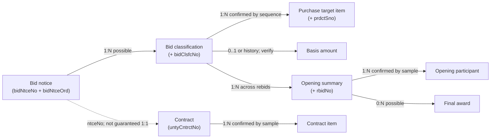

# Market data relationships

## 1. Relationship principles

- Preserve source identifiers as TEXT; leading zeroes and the new `RyyXX...` formats are meaningful.
- A notice is not a product, an opening, an award, or a contract. Each is an independently sourced entity.
- Links are confidence-rated. Missing links remain missing; names are never used as identity keys.
- `bidNtceNo` alone is insufficient where `bidNtceOrd`, `bidClsfcNo`, or `rbidNo` exists.

## 2. Confirmed source keys

| Concept | Official field(s) | Status |
|---|---|---|
| Notice | `bidNtceNo`, `bidNtceOrd` | CONFIRMED fields; composite entity key INFERRED |
| Notice classification | plus `bidClsfcNo` | CONFIRMED child discriminator |
| Rebid/opening | plus `rbidNo` | CONFIRMED child discriminator |
| Purchase item | plus `prdctSno` | CONFIRMED sequence |
| Opening participant | opening key + `prcbdrBizno`, `opengRank` | CONFIRMED fields; uniqueness NEEDS API VERIFICATION |
| Awarded company | `bidwinnrBizno` | CONFIRMED strong company identifier |
| Contract | `untyCntrctNo` | CONFIRMED contract-status identifier |
| Contract alternatives | `dcsnCntrctNo`, `cntrctRefNo` | CONFIRMED, optional |
| Contract-to-notice hint | `ntceNo` | CONFIRMED; may embed notice order in legacy data |
| Request link | bid `prcrmntReqNo`; contract `reqNo` | CONFIRMED fields, cross-format equivalence NEEDS API VERIFICATION |
| Product class | `prdctClsfcNo` | CONFIRMED 8-digit class |
| Detailed class | `dtilPrdctClsfcNo` | CONFIRMED 10-digit detailed class |
| Product identity | `prdctIdntNo` | CONFIRMED contract-item identifier |
| Institution | role-specific code fields | CONFIRMED; code namespaces may vary |
| Company | business registration number fields | CONFIRMED; masking/null behavior NEEDS API VERIFICATION |

## 3. Lifecycle and cardinality

| From → To | Candidate join | Cardinality | Confidence / caveat |
|---|---|---|---|
| notice → purchase item | `bidNtceNo + bidNtceOrd`, then classification | 1:N | CONFIRMED item sequence; notice search does not return classification number |
| notice/classification → basis amount | `bidNtceNo + bidNtceOrd + bidClsfcNo` | 0:1 current, history possible | INFERRED; future change API may produce versions |
| notice/classification → opening | add `rbidNo` | 1:N | CONFIRMED discriminator; includes failed/rebid/completed states |
| opening → participants | full opening key | 1:N | CONFIRMED by multi-row official sample |
| opening → awards | full opening key | 0:N | Do not assume one winner |
| award company → company | `bidwinnrBizno` | N:1 when present | Strongest confirmed identifier |
| participant → company | `prcbdrBizno` | N:1 when present | Strongest confirmed identifier |
| contract → companies | parsed `corpList[].business_number` | N:M | `corpList` is 0..N and carries representative/member roles |
| contract → demand institutions | parsed `dminsttList[].institution_code` | N:M | `dminsttList` is 0..N |
| notice → contract | normalized `ntceNo` to notice number/order | 0:N / uncertain | Contract field may concatenate legacy notice order and may omit it |
| contract → item | `untyCntrctNo` | 1:N | CONFIRMED by official sample |
| bid item → contract item | classification/product/name evidence | N:M / probabilistic | No direct source line ID; never enforce FK |

## 4. Institution model

A single `organization` entity is practical **INFERRED**, because the same code/name-shaped entity appears as notice institution, demand institution, and contract institution. Roles remain on relationship tables/columns:

- notice: `notice_organization` and `demand_organization` roles;
- contract: `contract_organization` plus N demand organizations;
- opening/award: demand and notice organization where supplied.

Do not merge organizations on name. Use `(code_namespace, organization_code)` when a code exists. The documents note that codes can be Ministry of Interior codes or PPS-assigned codes, so namespace resolution is **NEEDS API VERIFICATION**. Rows without a code get a local surrogate and remain unmerged unless later evidence appears.

## 5. Company model

Use one `market_company` entity keyed by normalized business registration number when available. Maintain occurrence tables for participant, winner, and contract-member roles. This supports competitor analysis without pretending every occurrence has complete attributes.

Rules:

- never identify by company name alone;
- preserve original formatted/masked business number;
- only create a strong link when a valid unmasked number exists;
- preserve joint-contract member role, share rate, and leader/member distinction from `corpList`;
- allow the same contract to have multiple companies.

## 6. Product model

Keep classifications as reusable lookup dimensions, but retain source labels on facts for historical fidelity:

- 8-digit `prdctClsfcNo` / name;
- 10-digit `dtilPrdctClsfcNo` / name;
- `prdctIdntNo` for a catalog item where supplied;
- free-text product/specification/Korean item names.

Market targeting should later combine classification codes, detailed names, item names, specifications and keywords. No pump filter is designed or implemented in this phase.

## 7. Link evidence and unresolved relationships

Store derived cross-domain links in `entity_link` with `link_type`, `confidence`, `evidence_json`, and `verified_at`, rather than putting an unreliable FK on a core table. Examples:

- exact notice number + order parsed from contract `ntceNo`: high confidence;
- exact request-number equality after verified normalization: medium/high;
- same product class + institution + close dates: low, analysis-only;
- name similarity: never automatic identity.

Unresolved items for live verification:

1. Whether contract `ntceNo` consistently encodes `bidNtceNo + bidNtceOrd` across old/new formats.
2. Whether `prcrmntReqNo` and `reqNo` share a stable canonical format.
3. Multiple-award representation in award status and opening-complete operations.
4. Whether basis amounts have multiple current rows for one full bid key.
5. A stable line discriminator for contract detail when `prdctIdntNo` is absent.
