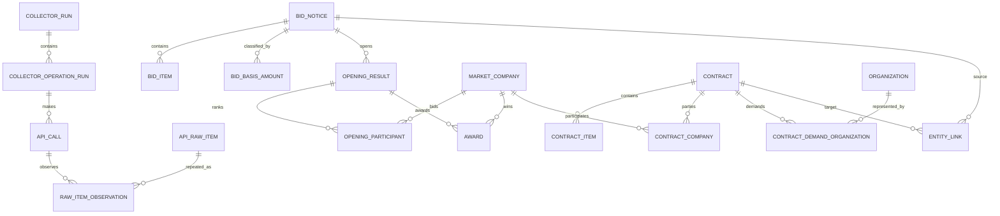

# Market SQLite schema

Phase 3-C applies only the collection/run and RAW tables described in section 2.
All domain tables remain proposals for later phases. See
`PHASE3C_RAW_PERSISTENCE.md` for the implemented columns, constraints, indexes,
and transaction boundary.

## 1. Storage conventions

- Source identifiers/codes: `TEXT`, never numeric.
- KRW amounts: `INTEGER` after strict integer-string validation. If a source ever contains decimals/out-of-range values, preserve raw and reject normalization; do not use `REAL`.
- Quantities/rates/scores: canonical decimal `TEXT` initially to avoid floating-point loss. Add scaled integer columns only after actual scale/range verification.
- Dates/times: keep `*_raw TEXT`; when parseable also store ISO-like local Korea wall time `*_local TEXT` and `*_precision`. Do not silently reinterpret as UTC.
- Booleans: `INTEGER CHECK (value IN (0,1))`, nullable where the API field is optional.
- Every normalized fact records `source_operation`, `source_raw_item_id`, `first_seen_at`, `last_seen_at`, and `row_hash`.

## 2. Collection and raw tables

### `collector_run`

Manual user action. Columns: `run_id TEXT PK`, `mode TEXT` (`period`/`incremental`), requested local range, status, started/completed timestamps, total calls/items/inserted/updated/unchanged/failed, error summary, app/parser/schema versions. Index `(started_at DESC)`.

### `collector_operation_run`

`operation_run_id TEXT PK`, `run_id FK`, `service`, `operation`, query-basis, effective range, overlap, status (`pending/running/succeeded/failed/skipped`), page/call/item/change counters, error, timestamps. Unique `(run_id, operation)`. It enables partial success without rolling back other operations.

### `collector_checkpoint`

`checkpoint_id INTEGER PK`, `service`, `operation`, `query_basis`, last successful boundary raw/normalized, overlap configuration, successful run/operation IDs, updated time, version. Unique `(service, operation, query_basis)`. The opening-complete fan-out uses a separate work queue rather than a fake timestamp checkpoint.

### `collector_work_item`

For identity-driven fan-out (`getOpengResultListInfoOpengCompt` and optional contract detail by number): operation, source identity JSON/hash, state, attempts, next eligible time, last error, source operation run. Unique `(operation, identity_hash)` for active/current work.

### `api_call`, `api_response_blob`, `api_raw_item`, `raw_item_observation`

As defined in `RAW_DATA_STRATEGY.md`. Key constraints: blob SHA unique; raw item `(operation,item_sha256)` unique; observation unique `(call_id,page_no,item_ordinal)`.

## 3. Domain tables

### `bid_notice`

Purpose: current searchable notice header from `getBidPblancListInfoThngPPSSrch`.

**Phase 3-D status: implemented by migration v2.** The implemented subset,
types, warning policy, semantic hash, and revision table are specified in
`PHASE3D_BID_NOTICE_NORMALIZATION.md`. Organization references remain code/name
snapshots because the organization master is deferred.

PK: local `bid_notice_id INTEGER`. Natural unique: `(bid_ntce_no, bid_ntce_ord)`.

Core columns:

- identity/state: `bid_ntce_no TEXT NOT NULL`, `bid_ntce_ord TEXT NOT NULL`, `unty_ntce_no`, `previous_bid_ntce_no`, `notice_kind_name`, `registration_type_name`, `rebid_notice_yn`;
- text/method: `bid_ntce_name`, `reference_no`, `bid_method_name`, `contract_method_name`, `award_method_code/name`;
- organizations: notice/demand organization IDs plus source code/name snapshots;
- timeline raw/local: notice, bid begin/close, opening, rebid opening, registration, change;
- amounts as INTEGER: allocated budget, estimated price, VAT, industry VAT, participation fee;
- product hint: detailed class number/name, specification, quantity decimal TEXT, unit, unit price INTEGER, source packed product list;
- classification/region/joint-contract flags and source URLs.

Indexes: `(notice_posted_local)`, `(opening_local)`, `(registration_local)`, notice/demand organization, detailed class, `bid_ntce_name`, `reference_no`, `procurement_request_no`. Use FTS5 later for names/specifications; do not implement now.

Update: UPSERT current row when `row_hash` changes; append `entity_revision` before replacement.

### `bid_item`

Purpose: purchase-target goods.

**Phase 3-E status: implemented by migration v3.** The live-verified mapping,
type policy, parent deferral, revisions, and lineage are specified in
`PHASE3E_BID_ITEM_BASIS_AMOUNT.md`.

Unique: `(bid_ntce_no,bid_ntce_ord,bid_clsfc_no,product_seq)`. Columns include demand organization snapshot/link, product/detailed classification codes/names, specification, quantity decimal TEXT, unit, unit price INTEGER, delivery deadline/day/place/condition, notice-posted raw/local. FK to notice is nullable/deferrable by `(number,order)` because ingestion order can vary.

Indexes: product class, detailed class, demand organization, notice key, item/spec text.

### `bid_basis_amount`

Purpose: current basis/evaluation amounts per classification.

**Phase 3-E status: implemented by migration v3.** Natural unique key is now
`(bid_ntce_no,bid_ntce_ord,bid_clsfc_no)` based on the 24-field live response;
multiple concurrent rows for that full key remain an explicit unresolved case.

Unique candidate: `(bid_ntce_no,bid_ntce_ord,bid_clsfc_no)` **NEEDS API VERIFICATION**. Columns: notice name, basis amount, open time, reserve range rates, evaluation amount, difficulty and expense rates, insurance/safety/environment amounts, remarks, useful amount, input time. Update + revision history, not ignore.

### `opening_result`

Purpose: opening lifecycle summary.

Unique: `(bid_ntce_no,bid_ntce_ord,bid_clsfc_no,rebid_no)`. Columns: notice name, scheduled opening time, participant count, packed `opengCorpInfo` source text, progress state, input time, reserve-price-file flag, institution snapshots/links, result notice content. Current-state UPSERT + revision.

### `opening_participant`

Purpose: individual ranked offers from opening-complete.

Candidate unique: `(bid_ntce_no,bid_ntce_ord,bid_clsfc_no,rebid_no,business_no,opening_rank)` **NEEDS API VERIFICATION**. Columns: result division, company FK, original business number/name/CEO, rank, bid amount INTEGER, bid rate decimal TEXT, draw numbers, bid time, price/technical/overall score decimal TEXT, remark, URL. Index company, opening key, bid amount, rank.

### `award`

Purpose: final award occurrence, not a boolean on opening.

Candidate unique: `(bid_ntce_no,bid_ntce_ord,bid_clsfc_no,rebid_no,winner_business_no)` **NEEDS API VERIFICATION**. Columns: company link/snapshot, notice name/division, participant count, amount INTEGER, rate decimal TEXT, real opening time, award date, demand organization, registration time, winner contact/address. Index company, award date, demand institution, amount.

### `contract`

Purpose: searchable contract header.

Natural unique: `unty_cntrct_no`. Columns: business division, confirmed/reference/request/notice numbers, name, joint/long-term flags, conclusion date, contract date/period, law/method/payment, total/current contract amount INTEGER, guarantee/penalty rates decimal TEXT, contract institution, creditor, URLs, registration/change time, public-procurement classification.

Indexes: confirmed/reference/request/notice number, dates, institution, amount, class, contract name.

### `contract_item`

Purpose: line-like goods details.

PK local. No final natural unique until verified. Store `source_item_fingerprint TEXT` and initially unique `(unty_cntrct_no, source_item_fingerprint)`. Fingerprint inputs: product class/id, Korean item name, unit price, quantity, amount, delivery attributes; collision monitoring is mandatory.

Columns: contract identifiers snapshot, conclusion date, product class, product identity, names/origin, unit price INTEGER, quantity decimal TEXT, amount INTEGER, delivery code/name/day/deadline raw/local, registration/change time. Index contract, product class/id, amount.

## 4. Shared entities and relationship tables

### `organization`

`organization_id INTEGER PK`, `code_namespace`, `organization_code`, canonical/current name, first/last seen. Unique `(code_namespace,organization_code)` when code is non-null. Names are not unique.

### `market_company`

`company_id INTEGER PK`, normalized unmasked `business_no`, current display name/CEO/address/phone, first/last seen. Partial unique on valid `business_no`. Masked/absent numbers do not merge automatically.

### `contract_company`

Contract N:M members parsed from `corpList`: sequence, company type, joint-supply method, company snapshot, nationality, share decimal TEXT, creditor/contact, original encoded member. Unique `(contract_id,member_seq)`; secondary business-number index.

### `contract_demand_organization`

Contract N:M demand organizations parsed from `dminsttList`: sequence, organization, jurisdiction, department, officer/phone snapshots, original encoded member. Unique `(contract_id,member_seq)`.

### `product_classification`

`classification_no TEXT PK`, `level` (`product`/`detail`), current name, parent code where derivable, first/last seen. Facts retain their source name too.

### `entity_link`

Cross-domain link evidence: source/target entity type+ID, link type, confidence enum, evidence JSON, algorithm version, verified timestamp. Unique on endpoints/link type/evidence hash. It holds contract-notice and tentative item mappings that are not safe FKs.

### `entity_revision`

Append-only history for changed normalized rows: entity type/key, previous/new row hash, changed field summary JSON, raw item IDs, observed time, change source (`overlap`, explicit history API, delete API). Current tables remain fast for Search.

## 5. ER diagram

The diagram shows designed relationships; dashed/uncertain semantic links are intentionally represented through `entity_link`, not an enforced notice-to-contract FK.

## 6. UPSERT and history policy

| Data | Write policy |
|---|---|
| raw item/observation | content-addressed insert + observation append |
| notice, basis, opening, award, contract, item | insert or current-row update when hash differs; unchanged only updates observation/last-seen |
| participant occurrence | UPSERT after natural-key verification; otherwise fingerprint + revision |
| explicit future change history | append history, then reconcile current |
| explicit future deletion history | append evidence and set `source_deleted_at`; never hard-delete analytics facts |
| company/organization | evidence-based attribute merge; never name-only identity merge |

## 7. Migration gates

Before implementing SQL, validate: maximum amount range, decimal formats, null/empty behavior, contract-item key collisions, participant duplicates, code namespaces, real JSON key capitalization, and FTS5 availability in bundled SQLite.
